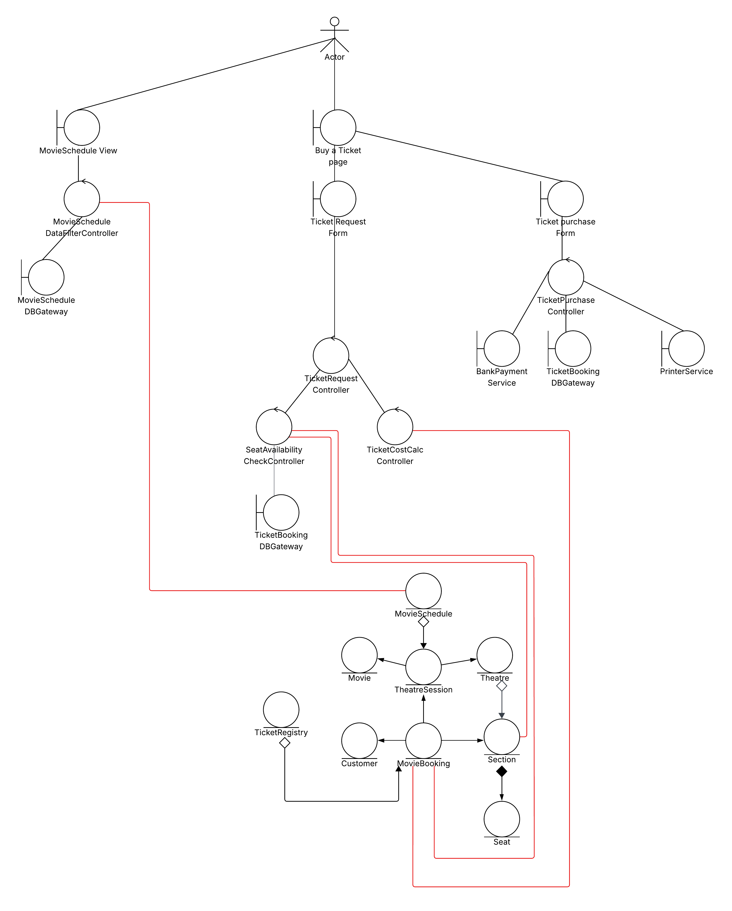

## Exercise

## OOAD Process

## Overall Usecase diagram

## Overall Class Diagram for Entities

## Collaboration Diagram 1 for view movie schedule usecase

## Collaboration Diagram 2 for request ticket usecase
1. choose movie from movie schdule
2. request ticket for choosed movie

## Collaboration Diagram 3 for purchase ticket usecase

## Overall class diagram (including entity, boundary, controller classes)
