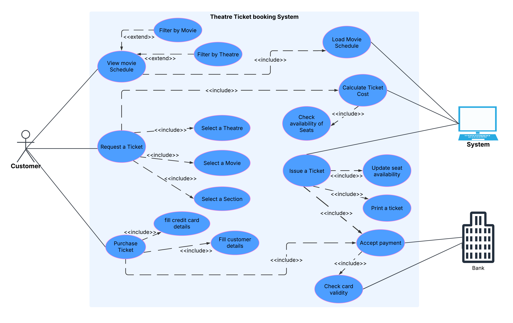
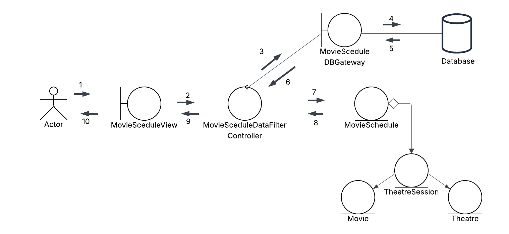
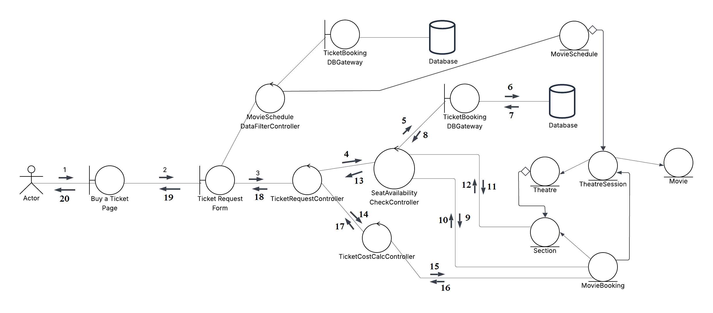
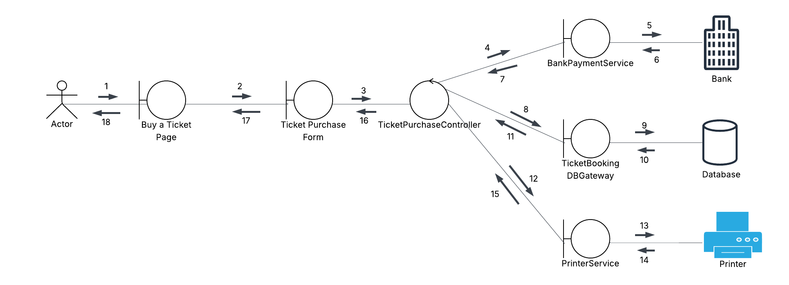

## Exercise

## OOAD Process

## Overall Usecase diagram

## Overall Class Diagram for Entities

## TODO - Overall state chart

## collaboration Diagram 1 for view movie schedule usecase

## TODO - collaboration Diagram 2 for request ticket usecase

## TODO - collaboration Diagram 3 for purchase ticket usecase

## TODO - Overall class diagram (including entity, boundary, controller classes)